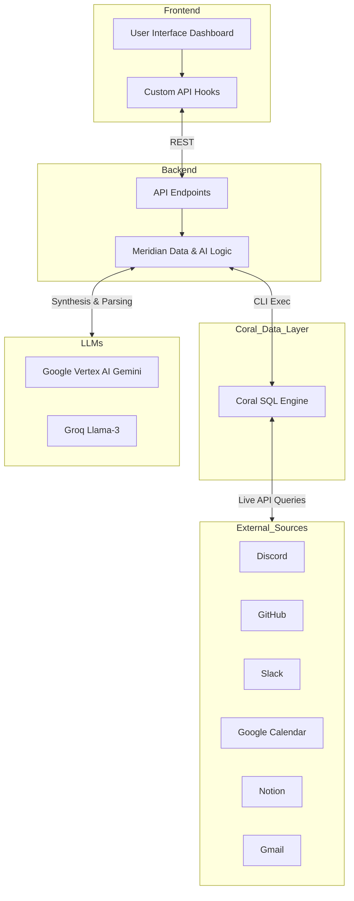

# Meridian

[](#)
[](#)
[](#)
[](#)
[](#)
[](#)
[](#)

Meridian (formerly ContextOS) is a retrieval-first personal intelligence dashboard. It unifies fragmented workflow data across platforms like Calendar, GitHub, Slack, Notion, and Discord into a single, beautifully designed operational command center. It leverages advanced LLM synthesis to provide actionable morning briefings, focus debt analysis, and a unified context timeline.

---

## Architecture Overview

Meridian consists of a React frontend and a Node.js/Express backend that securely interfaces with local and remote services. The frontend provides a rich, responsive interface with specialized panels for timelines, queries, and briefings. The backend orchestrates data retrieval, LLM synthesis, and prompt generation.



## How Coral Powers Meridian

Meridian utilizes the **Coral SQL Engine** as its foundational data layer. Instead of building complex REST or GraphQL integrations for every service and storing them in an intermediate database, Coral allows Meridian to query live APIs directly using standard SQL. By executing raw SQL against virtual schemas representing Google Calendar, GitHub, Slack, Discord, and Notion, Meridian instantly retrieves fresh, normalized data. The backend proxy formats these SQL commands dynamically, passing them to the Coral CLI environment. This seamless abstraction dramatically reduces the latency and complexity of aggregating personal intelligence data from heavily siloed platforms.

## Key Features

*   **Morning Briefing:** A summarized daily report generated by Vertex AI (Gemini 2.5 Pro) based on calendar events, unread emails, and pending tasks.
*   **Focus Debt Tracking:** Visualizes planned versus completed tasks to prevent attention sinkholes.
*   **Context Timeline:** A chronological activity stream aggregating all external data sources.
*   **Meridian Lens:** An interactive chat interface backed by Groq (Llama 3) that translates natural language questions into executable Coral SQL queries.
*   **Custom Discord Integration:** Employs a custom HTTP source specification to seamlessly integrate Discord messages, guilds, and member counts.

---

## Setup and Installation

### Prerequisites

1.  **Node.js** (v18 or higher)
2.  **npm** (v9 or higher for workspaces support)
3.  **Coral CLI** installed and added to PATH. [Installation Guide](https://coral.so/docs/install)
4.  **Google Cloud Platform Account** with Vertex AI enabled and Application Default Credentials (ADC) configured.

### Local Development

1.  **Clone the Repository**

    ```bash
    git clone https://github.com/GaneshBamalwa/coralHackathon.git
    cd coralHackathon/contextos
    npm install
    ```

2.  **Configure Environment Variables**
    
    Create a `.env` file in the root directory based on `.env.example`.

    ```env
    MOCK_MODE=false
    PORT=3001
    
    # LLM API Keys
    GROQ_API_KEY=your_groq_key
    GCLOUD_PROJECT=your_gcp_project_id
    GCLOUD_LOCATION=us-central1
    
    # Optional Source Identifiers
    GITHUB_OWNER=your_github_username
    GITHUB_REPO=your_repository_name
    ```

    Note: If Coral is unavailable, you can set `MOCK_MODE=true` to preview the application with realistic dummy data.

3.  **Configure Coral Sources**

    Standard sources can be added directly via the CLI:
    ```bash
    coral source add github
    coral source add slack
    coral source add google_calendar
    coral source add notion
    ```

    For the custom Discord integration:
    ```bash
    # Linux/macOS
    cp -r sources/discord/ ~/.coral/workspaces/default/sources/discord/
    
    # Windows (PowerShell)
    Copy-Item -Recurse sources\discord\ "$env:USERPROFILE\.coral\workspaces\default\sources\discord\"
    
    coral source add --file sources/discord/manifest.yaml
    ```
    Ensure you export `DISCORD_BOT_TOKEN` and `DISCORD_GUILD_ID` in your environment. Detailed instructions are available in `sources/discord/README.md`.

4.  **Start the Application**

    From the root `contextos` directory:
    ```bash
    # Start both backend and frontend concurrently
    npm run dev
    ```
    
    *   **Frontend:** http://localhost:5173
    *   **Backend:** http://localhost:3001

---

## API Reference

| Endpoint | Method | Description |
|---|---|---|
| `/api/query` | `POST` | Executes raw Coral SQL queries. |
| `/api/briefing` | `GET` | Returns synthesized daily briefing via Vertex AI. |
| `/api/focus-debt` | `GET` | Returns analytics on planned vs completed tasks over 7 days. |
| `/api/unfinished-loops` | `GET` | Surfaces high-touch, unresolved items across sources. |
| `/api/sources` | `GET` | Returns connectivity status for all configured Coral sources. |
| `/api/meridian` | `POST` | Translates natural language to SQL and returns formatted LLM answers. |
| `/api/health` | `GET` | Health check endpoint for system readiness. |

---

## Design System

The application utilizes a professional, clean interface optimized for data density and quick scanning. 

| Element | Description |
|---|---|
| **Typography** | Inter (UI components), JetBrains Mono (Data tables, Code blocks) |
| **Color Palette** | Slate/White base, Accent Blue for primary actions, Amber for warnings, Emerald for success states. |
| **Components** | Tailwind CSS custom utility classes, Glassmorphism panels, Micro-animations (glow, pulse, fade-in). |

## License

This project is licensed under the MIT License.
